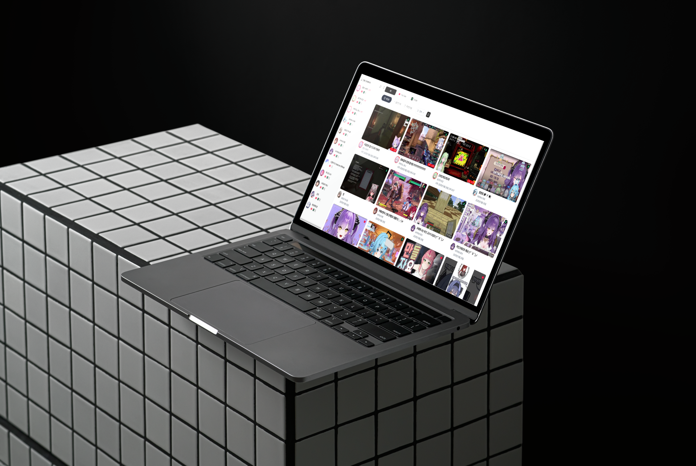
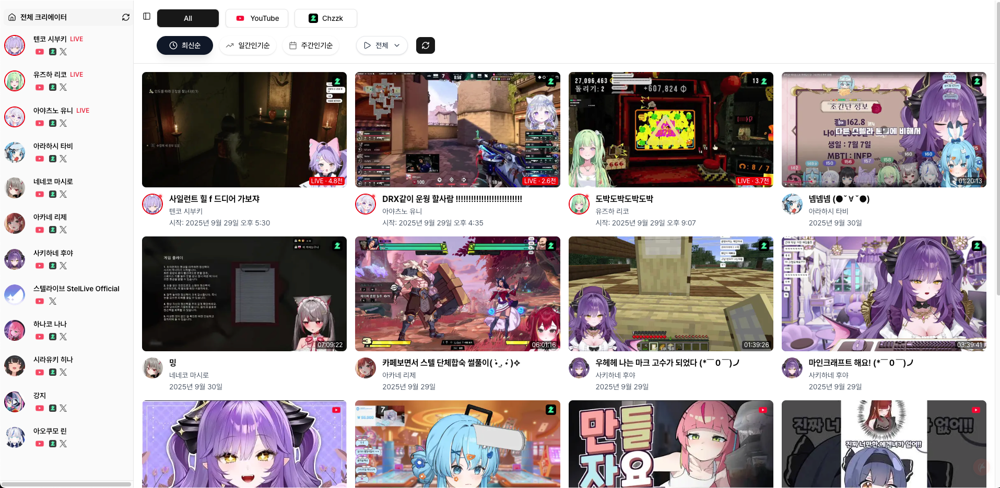
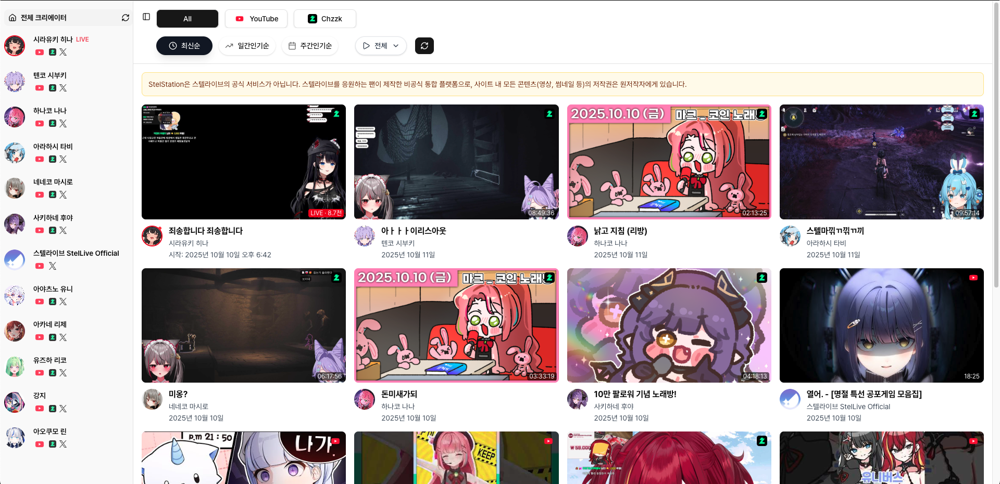
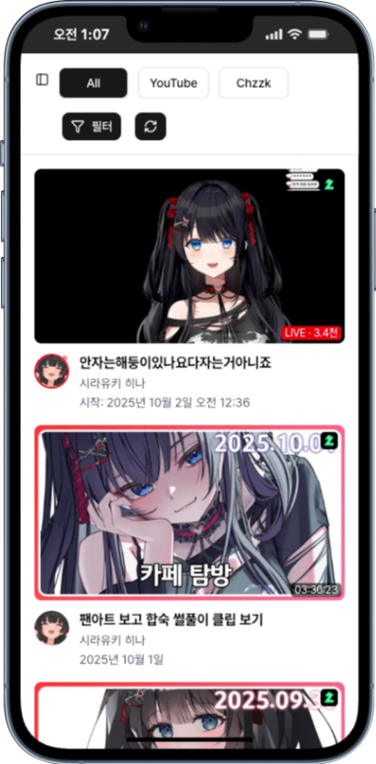
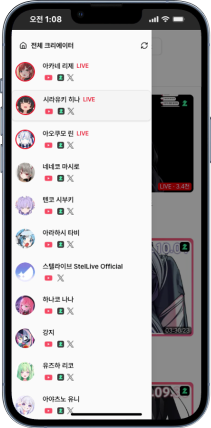
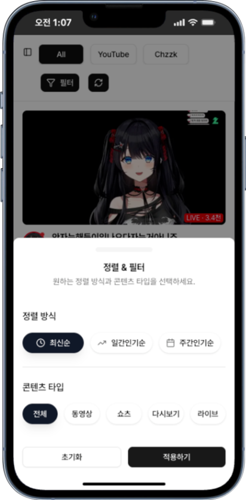

# 📺 StelStation - 스트리머 통합 플랫폼

![Repository Size][repository-size-shield] ![Stars][stars-shield] ![Forks][forks-shield] ![Issues][issues-shield] ![License][license-shield]

<!--프로젝트 대문 이미지-->

### 🌐 [프로젝트 사이트](https://stel-station.vercel.app/)

# 목차

📑 목차 보기

 

- [📖 프로젝트 소개](#-프로젝트-소개)
  - [🎯 해결하고자 하는 문제](#-해결하고자-하는-문제)
  - [✨ 주요 기능 및 해결책](#-주요-기능-및-해결책)
  - [🎯 프로젝트 목적](#-프로젝트-목적)
  - [📈 기대효과](#-기대효과)
  - [🛡️ 데이터 정책 & API 준수](#️-데이터-정책--api-준수-db--rpc)
  - [🛣️ 향후 개발 계획](#️-향후-개발-계획-roadmap)
- [🛠️ 기술 스택](#️-기술-스택)
  - [🎨 Frontend](#-frontend)
  - [⚡ Backend & Database](#-backend--database)
  - [🚀 Infrastructure & Tools](#-infrastructure--tools)
- [🖼️ 프로젝트 예시](#️-프로젝트-예시)
  - [🖥️ 데스크탑 (Desktop)](#️-데스크탑-desktop)
  - [📱 모바일 (Mobile)](#-모바일-mobile)
- [👨‍💻 개발자](#-개발자-developer)
- [📄 라이선스](#-라이선스)

# 📖 프로젝트 소개

Stel Station은 스텔라이브(StelLive) 멤버들이 YouTube와 **치지직(CHZZK)**에서 올리는 모든 영상을 한 곳에서 모아볼 수 있는 팬-메이드 통합 플랫폼입니다.

팬들은 유튜브·치지직을 오가며 콘텐츠를 찾아볼 필요 없이, Stel Station 하나로 멤버들의 영상, 쇼츠, VOD, 라이브까지 모두 탐색할 수 있습니다.

> 현재는 최근 120일 내의 콘텐츠만 조회할 수 있습니다.
이는 데이터 정확도와 성능 최적화를 위해 의도적으로 설정한 정책입니다.
오래된 영상까지 모두 유지할 경우 데이터 동기화 비용과 속도가 급격히 떨어지기 때문에, **팬들이 실제로 가장 많이 소비하는 최신 활동 구간(약 4개월)**을 집중적으로 제공하고 있습니다.

향후에는 온디맨드 하이드레이션 기능을 통해 120일이 지난 영상도 필요할 때 실시간으로 불러올 수 있도록 확장할 계획입니다.

## 🎯 해결하고자 하는 문제

### 팬(사용자)의 관점에서
>
> "라이브 방송은 치지직에서, 어제 올라온 영상은 유튜브에서... 좋아하는 스트리머의 콘텐츠를 놓치지 않으려고 여러 앱을 오가는 게 너무 번거로워요."

이처럼 스텔라이브 팬들은 여러 플랫폼에 흩어진 콘텐츠를 일일이 확인해야 하는 불편함을 겪고 있습니다. Stel Station은 이러한 문제를 해결하여 팬들이 **콘텐츠 탐색부터 시청까지의 경험을 매끄럽게 연결**하는 것을 목표로 합니다.

- 콘텐츠의 분산: 스트리머의 YouTube 채널과 Chzzk 채널에 콘텐츠가 나뉘어 있어 한눈에 파악하기 어렵습니다.

- 다양한 콘텐츠 유형: 유튜브 영상, 쇼츠, VOD, 생방송 등 다양한 형태의 콘텐츠를 각각 찾아봐야 합니다.

- 인기 콘텐츠 파악의 어려움: 여러 채널에 걸쳐 지금 어떤 영상이 인기를 끌고 있는지 확인하기 번거롭습니다.

Stel Station은 이러한 문제들을 해결하여 팬들이 더욱 편하고 즐겁게 콘텐츠를 소비할 수 있는 환경을 제공하고자 합니다.

## ✨ 주요 기능 및 해결책

- **통합 콘텐츠 피드**: YouTube / Chzzk API 자동 수집 + 통합 제공
- **실시간 라이브 표시**: 현재 방송 중인 멤버를 피드 상단에 표시
- **플랫폼 및 타입별 필터링**: 유튜브 영상 및 쇼츠, 치지직 다시보기(VOD) 및 라이브 선택 가능
- **정렬 기능**: 최신순, 일간/주간 조회수 증가량(Δ) 기반 인기순
- **직관적 UI/UX**: 멤버별 사이드바 탐색, 반응형 화면

## 🎯 프로젝트 목적

1. **콘텐츠 접근성 극대화**: 여러 플랫폼의 콘텐츠를 단일 허브에서 탐색
2. **향상된 팬 경험 제공**: 실시간 라이브 + 인기순 정렬을 통한 재미 강화
3. **데이터 기반 아카이브**: 120일 콘텐츠 집중 관리 + 1일, 7일 Δ 기반 인기 계산
4. **정책 준수 기반 운영**: YouTube API 정책에 맞춘 안전한 데이터 보관

## 📈 기대효과

1. 향상된 콘텐츠 발견 및 소비
    - Stel Station은 팬들이 좋아하는 스트리머의 모든 콘텐츠를 한 곳에서 쉽게 탐색할 수 있도록 도와줍니다.
    - 최신순 정렬 외에도 일간/주간 인기 순위를 통해 놓쳤던 재미있는 영상을 쉽게 발견할 수 있습니다.

2. 시간 절약 및 편의성 증대
    - 여러 플랫폼을 방문할 필요 없이 Stel Station 한 곳에서 모든 멤버의 콘텐츠를 확인할 수 있어 편리합니다.

## 🛡️ 데이터 정책 & API 준수 (DB & RPC)

Stel Station은 YouTube API Services 정책을 준수하기 위해 다음과 같은 데이터 관리 원칙을 따릅니다:

- videos_cache (콘텐츠 메타데이터)
  - 최근 120일 내 영상의 메타데이터 보관
  - 매일 자동 갱신하여 30일 이상 미갱신 상태로 남지 않음
  - 정책상 요구되는 “30일 내 삭제 또는 갱신” 조건 충족
- video_stats_daily (일간 통계 스냅샷)
  - 영상 조회수 등 통계 데이터는 30일간만 보관
  - 30일이 지나면 자동 삭제 → 정책의 “비인가 통계 30일 제한” 준수
- 정렬 및 인기순 처리
  - 조회수 자체를 변형하거나 새로운 점수로 가공하지 않음
  - 단순히 **업로드일자 + Δ(일간/주간 조회수 변화량)**를 기준으로 정렬만 제공
  - 숫자 자체를 노출하지 않고 영상 날짜·제목만 표시

> ✅ 결론적으로, Stel Station은
  >
  > - 비인가 통계는 30일만 보관
  > - 메타데이터는 120일간 보관하되 매일 최신화
  > - 인기순은 단순 정렬 기능으로만 제공
  >
  > 으로 YouTube API 정책 위반 소지를 최소화하고 있습니다.

## 🛣️ 향후 개발 계획 (Roadmap)

- 찜하기 및 통합 재생목록
- 사용자 맞춤형 구독 관리
- 120일 지난 콘텐츠 온디맨드 하이드레이션

# 🛠️ 기술 스택

### 🎨 Frontend

### ⚡ Backend & Database

### 🚀 Infrastructure & Tools

# 🖼️ 프로젝트 예시

### 🖥️ 데스크탑 (Desktop)

| 메인 피드 (Main Feed) |
| :----------------------------------------------------------: |
|  |

| 크리에이터 피드 (Creator Feed) |
| :----------------------------------------------------------: |
|  |
  
 

### 📱 모바일 (Mobile)

| 메인 피드 (Main Feed) | 크리에이터 사이드바 (Creator Sidebar) | 필터 (Filter) |
| :------------------------------------------------------: | :--------------------------------------------------------------------: | :--------------------------------------------------: |
|  |  |  |

# 👨‍💻 개발자 (Developer)

|
|:-:|
|**총괄** 🐳송병훈 [@sbs1253](https://github.com/sbs1253)|

# 📄 라이선스

이 프로젝트는 MIT 라이선스를 따릅니다. 자세한 내용은 [LICENSE](LICENSE) 파일을 참고해주세요.

---

🔒 [관리자 도구](https://stel-station.vercel.app/admin) - 내부 통계 확인용

<!--배지 URL-->
[repository-size-shield]: https://img.shields.io/github/repo-size/sbs1253/stelStation
[stars-shield]: https://img.shields.io/github/stars/sbs1253/stelStation
[forks-shield]: https://img.shields.io/github/forks/sbs1253/stelStation
[issues-shield]: https://img.shields.io/github/issues/sbs1253/stelStation
[license-shield]: https://img.shields.io/github/license/sbs1253/stelStation
